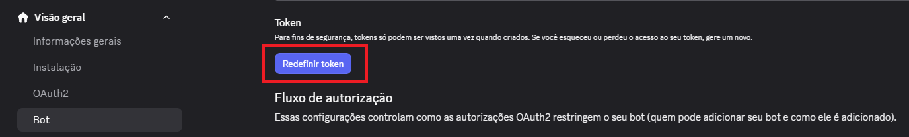
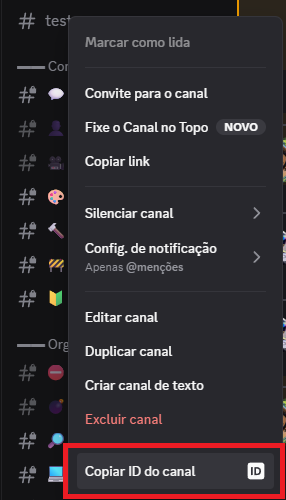
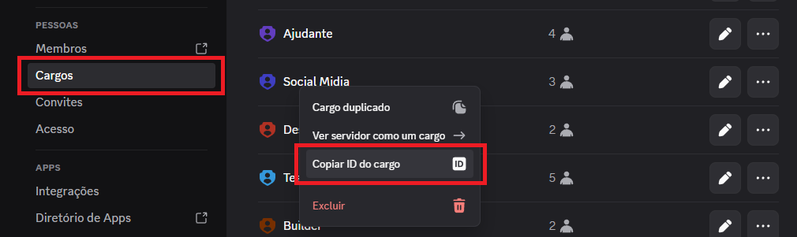

<br/>

<table>
  <tr>
    <td width="58%" valign="middle">
      <h1>Fast Patch Notes</h1>
      <p>
        <strong>A Discord bot that turns quick messages into standardized patch notes.</strong>
      </p>
      <p>
        Write a simple update in the configured channel and let the bot handle the rest:
        it republishes the message as a webhook embed, creates a discussion thread,
        mentions configured roles and adds feedback reactions.
      </p>
      <p>
        
        
        
      </p>
    </td>
    <td width="42%" align="center" valign="middle">
      
    </td>
  </tr>
</table>

<div align="center"><strong>FULLY CUSTOMIZABLE!</strong></div>

<br/>

<div align="center">
  <h2>Features</h2>
</div>

<table>
  <tr>
    <td width="50%" valign="top">
      <h3>Automatic patch notes</h3>
      <p>Turns regular messages into organized embeds while preserving lists and line breaks.</p>
    </td>
    <td width="50%" valign="top">
      <h3>Webhook publishing</h3>
      <p>Uses a configured webhook or automatically creates one with a custom name and avatar.</p>
    </td>
  </tr>
  <tr>
    <td width="50%" valign="top">
      <h3>Discussion threads</h3>
      <p>Creates a thread on the patch notes message to keep update discussions in one place.</p>
    </td>
    <td width="50%" valign="top">
      <h3>Mentions and reactions</h3>
      <p>Sends configured role mentions and adds positive and negative feedback reactions.</p>
    </td>
  </tr>
</table>

<br/>

<div align="center">
  <h2>Preview</h2>
  <p>See the bot formatting a message into patch notes.</p>
  
</div>

<br/>

## Requirements

- Node.js 20 or newer
- A bot created in the Discord Developer Portal
- `Message Content Intent` enabled for the bot
- Discord channel permissions for messages, webhooks, reactions and threads

<details>
  <summary><strong>How to create and invite a bot</strong></summary>

## Invite The Bot

1. Open the Discord Developer Portal:
   https://discord.com/developers/applications

2. Open your bot application.

3. Go to **OAuth2** > **URL Generator**.

4. Under **Scopes**, select:
   - `bot`

5. Under **Bot Permissions**, select:
   - View Channels
   - Send Messages
   - Manage Messages
   - Manage Webhooks
   - Add Reactions
   - Read Message History
   - Create Public Threads
   - Send Messages in Threads

6. Copy the generated URL at the bottom of the page and open it in your browser.

After inviting the bot, check the channel configured in `target_channel_id` and make sure the bot role can view and send messages there.

</details>

## Configuration

Install dependencies:

```bash
npm install
```

Copy the example config and start editing it:

```bash
copy config.example.yml config.yml
```

### Bot Token

Your bot created in the [Discord Developer Portal](https://discord.com/developers/applications) has a token. Copy it and place it in `token`:

<div align="center">
  
</div>

```yml
# Bot token. You can also set it through the DISCORD_TOKEN environment variable.
token: "PUT_YOUR_BOT_TOKEN_HERE"
```

### Target Channel

The bot listens to one text channel in your server. Copy that channel ID and place it in `target_channel_id`:

<div align="center">
  
</div>

```yml
# Channel the bot should watch.
target_channel_id: "1524803982105772213"
```

### Mentioned Roles

The bot can mention roles to notify players. Add every role ID you want to notify to the `mentioned_roles` array:

<div align="center">
  
</div>

```yml
# Roles mentioned in the next message, right after the embed.
mentioned_roles:
  - "123456789012345678"
```

## Start The Bot

```bash
npm start
```
